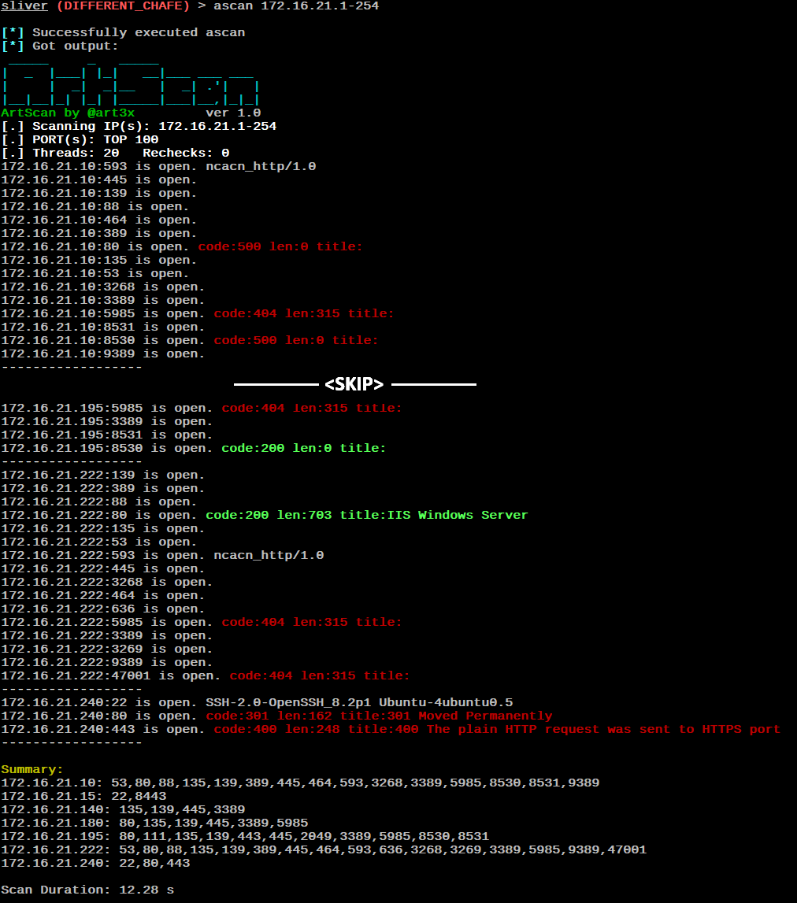

# ArtScan

ArtScan is a tiny, convenient, and very fast port scanner written in C. It is perfect for pentesting and red team engagements. This version is a module for Sliver C2. Its size is only **20 KB**.



## Features

* IP ranges and port ranges scan
* TOP 100 common ports scan
* Perform ping scan only (skip port scan)
* NetBIOS name lookup
* Grab answers and HTTP responses on opened ports

## Usage

```
Usage: <ipRange> [portRange] [-t threadLimit] [-r rechecks] [-Pn] [-i] [-Nb] [-h]
  ipRange:   Single IP or range (e.g., 192.168.1.1-100 or 192.168.1.1-192.168.1.100)
  portRange: Single port, range (80-90), or comma-separated list (22,80,443)
  -t:        Set thread limit (default: 20, max: 40)
  -r:        Set extra rechecks for unanswered ports (default: 1, max: 10)
  -Pn:       Disable ping (skip host availability check)
  -i:        Perform ping scan only (skip port scan)
  -Nb:       Enable NetBIOS name lookup
  -h:        Display this help message
```

## Installation

Open the Visual Studio solution and compile two release binaries, one for x86 and the other for x64.
Combine it with the [extension.json](./extension.json) file, either into a directory or a `.tar.gz` file.
Copy it over to the Sliver C2 server, then in the Sliver console `extensions install /path/to/extension_dir`.
Restart the Sliver console and you have a new command `ascan` which launches the scan.

The other method: put dll's and extension.json file into `.sliver-client/extensions/ascan/` folder, reload sliver.